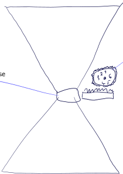

<!--lint disable list-item-indent-->
<!--lint disable list-item-bullet-indent-->

# tempushaphe
sandglass with adjustable duration

[tempus](https://www.albertmartin.de/latein/?q=tempus) = Zeit = time  
[haphe](https://www.albertmartin.de/latein/?q=haphe) = feiner Sand = fine sand

first sketch:

for the current status see [research.md](research.md)

this project is currently on hold.

 

 

---

# License
<!-- license info -->

 

    all files in tempushaphe
 by
<a xmlns:cc="http://creativecommons.org/ns#"
        href="https://github.com/s-light/tempushaphe"
        property="cc:attributionName"
        rel="cc:attributionURL">
    Stefan Krüger (s-light)
</a>
are licensed under a 
<a rel="license" href="http://creativecommons.org/licenses/by/4.0/">
    Creative Commons Attribution 4.0 International License
</a>.

all software parts/files are licensed under [MIT](LICENSE).

<!-- license info end -->
